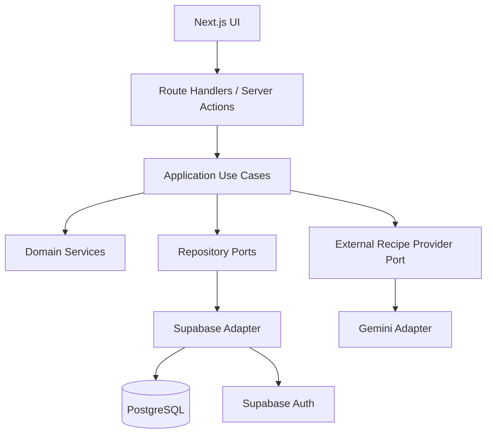

# MASTER PROMPT — FOOD FINDER

## Rol

Actúa como un **Staff / Principal Software Engineer** con experiencia avanzada en:

- Next.js
- React
- TypeScript
- App Router
- Supabase
- PostgreSQL
- Supabase Auth
- REST APIs
- Arquitectura Hexagonal / Ports & Adapters
- Domain-Driven Design pragmático
- SOLID
- Clean Architecture
- Testing
- Seguridad web
- Integración con APIs externas
- UX/UI responsive
- Aplicaciones PWA
- Arquitecturas preparadas para Capacitor/iOS

Tu responsabilidad es **diseñar e implementar el proyecto completo**, no simplemente dar recomendaciones.

Debes inspeccionar primero el repositorio existente antes de modificar archivos.

No destruyas código existente sin una razón clara.

Si el repositorio está vacío, crea el proyecto desde cero.

---

# 1. PRODUCTO

## Nombre provisional

`Food Finder`

El nombre puede cambiarse posteriormente.

## Objetivo

Construir una aplicación web moderna que permita al usuario indicar qué ingredientes tiene disponibles y descubrir qué recetas puede preparar con ellos.

La pregunta principal del producto es:

> **"¿Qué puedo cocinar con lo que tengo?"**

La aplicación NO debe estar limitada a una gastronomía específica.

Debe ser un sistema de descubrimiento de recetas **multicocina y potencialmente global**.

Por ejemplo, si el usuario tiene:

- papa
- carne
- huevo

la aplicación puede recomendar:

- causa limeña — Perú
- milanesa — Argentina
- tortilla española — España
- carne con papas
- tacos de carne
- otras recetas compatibles

La gastronomía colombiana puede ser una categoría importante y puede tener contenido propio desde el MVP, pero **NO debe ser una restricción global del sistema**.

---

# 2. PRINCIPIO CENTRAL DEL PRODUCTO

El producto debe estar construido alrededor de esta idea:

> **Ingredientes → posibilidades culinarias**

No:

> Ingredientes → recetas colombianas

La aplicación debe descubrir posibilidades de diferentes gastronomías basándose principalmente en los ingredientes disponibles.

La cocina/gastronomía es una dimensión de:

- clasificación
- descubrimiento
- filtrado
- preferencias

pero no una restricción obligatoria.

Por defecto:

```text
cuisine = ALL
```

Es decir, el usuario recibe recomendaciones de diferentes gastronomías.

---

# 3. EJEMPLO DE EXPERIENCIA

El usuario entra a la aplicación.

Ve:

```text
¿Qué tienes en tu cocina?

[ Papa ]
[ Carne ]
[ Huevo ]
[ + Agregar ingrediente ]

¿Qué quieres preparar?

[ Desayuno ]
[ Almuerzo ]
[ Cena ]
[ Cualquier momento ]

Cocina:

[ Todas las cocinas ▼ ]

[ BUSCAR RECETAS ]
```

El sistema puede devolver:

```text
Causa Limeña
Perú

92% de coincidencia

✓ Papa
✓ Huevo
⚠ Falta atún

[Ver receta]
```

```text
Milanesa
Argentina

87% de coincidencia

✓ Carne
✓ Huevo
⚠ Falta pan rallado

[Ver receta]
```

```text
Tortilla Española
España

84% de coincidencia

✓ Papa
✓ Huevo
⚠ Falta cebolla

[Ver receta]
```

El usuario debe poder explorar diferentes gastronomías.

---

# 4. OBJETIVO DEL MVP

El MVP debe permitir:

1. Registrarse.
2. Iniciar sesión.
3. Cerrar sesión.
4. Administrar ingredientes disponibles.
5. Crear una despensa/pantry personal.
6. Buscar ingredientes.
7. Añadir ingredientes a la despensa.
8. Eliminar ingredientes.
9. Editar cantidades/unidades.
10. Elegir tipo de comida.
11. Elegir opcionalmente una gastronomía.
12. Obtener recomendaciones.
13. Ver porcentaje de coincidencia.
14. Ver ingredientes disponibles.
15. Ver ingredientes faltantes.
16. Ver detalles de una receta.
17. Guardar recetas favoritas.
18. Eliminar favoritos.
19. Consultar favoritos.
20. Buscar recetas.
21. Utilizar recetas internas.
22. Utilizar Gemini como fuente externa (recetas generadas con IA).
23. Combinar resultados internos y externos.
24. Manejar correctamente errores del proveedor externo (Gemini).
25. Mantener la aplicación funcional si el proveedor externo (Gemini) está caído.
26. Tener una arquitectura preparada para futuras fuentes de recetas.
27. Usar IA (Gemini) como fuente externa y mantener la arquitectura preparada para futuras capacidades de IA.

---

# 5. STACK TECNOLÓGICO

Utiliza versiones actuales y compatibles en el momento de implementación.

Antes de instalar dependencias, verifica las versiones estables actuales y compatibles.

No utilices versiones antiguas solamente porque aparezcan en ejemplos viejos.

## Frontend

- Next.js latest stable compatible
- React latest compatible
- TypeScript
- App Router
- Server Components
- Client Components únicamente cuando sean necesarios
- Tailwind CSS
- shadcn/ui
- Lucide React
- React Hook Form
- Zod

## Backend

El backend debe vivir dentro del mismo proyecto Next.js.

Utilizar:

- Next.js Route Handlers
- Server Components
- Server Actions cuando tengan sentido
- Application Services
- Use Cases
- Domain Services
- Ports
- Adapters

No crear un backend separado durante el MVP.

---

# 6. BASE DE DATOS

Utilizar:

- Supabase
- PostgreSQL
- Supabase Auth
- Supabase Row Level Security

Dependencias principales:

- `@supabase/supabase-js`
- `@supabase/ssr`

Verifica los nombres actuales/recomendados de las variables de Supabase antes de implementar.

---

# 7. ARQUITECTURA

Utilizar una arquitectura:

**Hexagonal Architecture / Ports & Adapters**

con separación clara entre:

```text
Presentation
      ↓
Application
      ↓
Domain
      ↓
Ports
      ↓
Infrastructure / Adapters
```

Regla fundamental:

> El dominio NO debe depender de Next.js, React, Supabase, Gemini ni ninguna tecnología externa.

El dominio debe ser independiente.

---

# 8. CAPAS

## Presentation

Responsable de:

- UI
- páginas
- componentes
- formularios
- Route Handlers
- validación de entrada
- serialización HTTP

No debe contener lógica de negocio compleja.

---

## Application

Responsable de:

- casos de uso
- coordinación
- DTOs
- interfaces/ports
- autorización a nivel de caso de uso
- orquestación de repositorios y servicios

---

## Domain

Responsable de:

- entidades
- value objects
- reglas de negocio
- servicios de dominio
- errores de dominio
- lógica de matching
- lógica de recomendaciones

No importar:

- Next.js
- React
- Supabase
- Gemini
- fetch específico
- componentes UI

---

## Infrastructure

Responsable de:

- Supabase
- PostgreSQL
- Gemini
- HTTP
- persistencia
- autenticación técnica
- mappers
- clientes externos

---

# 9. ESTRUCTURA DE CARPETAS

Utiliza una estructura similar a:

```text
src/
├── app/
│   ├── (auth)/
│   │   ├── login/
│   │   │   └── page.tsx
│   │   └── register/
│   │       └── page.tsx
│   │
│   ├── (dashboard)/
│   │   ├── page.tsx
│   │   ├── pantry/
│   │   │   └── page.tsx
│   │   ├── recipes/
│   │   │   ├── page.tsx
│   │   │   └── [id]/
│   │   │       └── page.tsx
│   │   ├── favorites/
│   │   │   └── page.tsx
│   │   └── profile/
│   │       └── page.tsx
│   │
│   ├── api/
│   │   ├── recipes/
│   │   │   ├── route.ts
│   │   │   ├── [id]/
│   │   │   │   └── route.ts
│   │   │   └── recommendations/
│   │   │       └── route.ts
│   │   │
│   │   ├── ingredients/
│   │   │   ├── route.ts
│   │   │   └── search/
│   │   │       └── route.ts
│   │   │
│   │   ├── cuisines/
│   │   │   └── route.ts
│   │   │
│   │   ├── pantry/
│   │   │   ├── route.ts
│   │   │   └── [id]/
│   │   │       └── route.ts
│   │   │
│   │   └── favorites/
│   │       ├── route.ts
│   │       └── [recipeId]/
│   │           └── route.ts
│   │
│   ├── layout.tsx
│   └── page.tsx
│
├── components/
│   ├── ui/
│   ├── layout/
│   ├── auth/
│   ├── pantry/
│   ├── recipes/
│   └── filters/
│
├── domain/
│   ├── entities/
│   ├── value-objects/
│   ├── services/
│   ├── errors/
│   └── repositories/
│
├── application/
│   ├── use-cases/
│   ├── dto/
│   ├── ports/
│   └── services/
│
├── infrastructure/
│   ├── supabase/
│   │   ├── client/
│   │   ├── repositories/
│   │   ├── mappers/
│   │   └── auth/
│   │
│   ├── gemini/
│   │   ├── client/
│   │   ├── schemas/
│   │   └── providers/
│   │
│   └── config/
│
├── lib/
│   ├── validation/
│   ├── errors/
│   ├── logging/
│   └── utils/
│
└── types/
    └── database.types.ts

supabase/
├── migrations/
├── seed.sql
└── config.toml

tests/
├── unit/
├── integration/
└── e2e/

docs/
├── architecture.md
├── database.md
├── api.md
├── setup.md
└── decisions/
```

Puedes adaptar la estructura si existe una alternativa claramente mejor para la versión actual de Next.js, pero mantén la separación arquitectónica.

---

# 10. DOMAIN ENTITIES

Crear como mínimo:

## Recipe

Debe representar una receta independiente de su origen.

Campos conceptuales:

- id
- name
- slug
- description
- cuisineId
- country
- region
- mealType
- instructions
- preparationTime
- cookingTime
- servings
- difficulty
- imageUrl
- source
- sourceUrl
- timestamps

`source` debe permitir conceptualmente:

```text
INTERNAL
SPOONACULAR
AI_GENERATED
OTHER
```

En el MVP: `INTERNAL` para el catálogo interno y `AI_GENERATED` para las recetas generadas por Gemini; `SPOONACULAR` y `OTHER` quedan reservados para fuentes externas futuras.

---

## Cuisine

La gastronomía debe ser una entidad/catalogo extensible.

NO utilizar un enum rígido que obligue a modificar código cada vez que se agregue una cocina.

Campos:

- id
- name
- slug
- country
- region
- description
- createdAt
- updatedAt

Ejemplos:

```text
Colombian
Peruvian
Argentinian
Mexican
Italian
Spanish
French
Japanese
Chinese
Thai
Indian
American
Mediterranean
Korean
Brazilian
Other
```

Esta lista NO debe considerarse definitiva.

Agregar nuevas cocinas debe poder hacerse mediante datos.

---

## Ingredient

Campos:

- id
- name
- normalizedName
- category
- isPantryStaple
- createdAt
- updatedAt

---

## RecipeIngredient

Campos:

- recipeId
- ingredientId
- quantity
- unit
- optional
- notes

---

## PantryItem

Campos:

- id
- userId
- ingredientId
- quantity
- unit
- createdAt
- updatedAt

---

## FavoriteRecipe

Campos:

- userId
- recipeId
- createdAt

---

# 11. VALUE OBJECTS

Crear como mínimo:

- IngredientName
- MealType
- Quantity
- Unit
- RecipeMatchScore

No convertir `Cuisine` en un enum rígido.

La gastronomía debe ser extensible mediante la entidad/catalogo `Cuisine`.

MealType puede tener:

```text
BREAKFAST
LUNCH
DINNER
SNACK
DESSERT
ANY
```

---

# 12. REPOSITORY PORTS

Crear interfaces independientes de Supabase:

```text
RecipeRepository
IngredientRepository
CuisineRepository
PantryRepository
FavoriteRepository
UserRepository
```

El dominio/application layer no debe conocer que los repositorios utilizan Supabase.

---

# 13. USE CASES

Implementar como mínimo:

## Auth

- RegisterUser
- LoginUser
- LogoutUser
- GetCurrentUser

## Pantry

- AddPantryIngredient
- RemovePantryIngredient
- UpdatePantryIngredient
- GetUserPantry
- ClearUserPantry

## Recipes

- FindRecipesFromPantry
- GetRecipeById
- SearchRecipes
- GetRecipesByMealType

## Cuisine

- GetCuisines
- GetCuisineById

## Favorites

- AddFavoriteRecipe
- RemoveFavoriteRecipe
- GetFavoriteRecipes

---

# 14. RECOMMENDATION ENGINE

Crear:

```text
RecipeRecommendationService
```

Debe ser una pieza importante del dominio/application.

Entrada conceptual:

```text
availableIngredients
mealType?
cuisine?
maxPreparationTime?
difficulty?
dietaryPreferences?
```

Salida:

```text
recipe
matchScore
availableIngredients
missingIngredients
optionalMissingIngredients
```

---

# 15. MATCHING ALGORITHM

El algoritmo inicial debe ser sencillo, explicable y extensible.

Base:

```text
available required ingredients
/
total required ingredients
```

Ejemplo:

Una receta necesita:

```text
5 ingredientes obligatorios
```

El usuario tiene:

```text
4
```

Score base:

```text
4 / 5 = 80%
```

Pero el algoritmo debe considerar posteriormente:

- ingredientes obligatorios
- ingredientes opcionales
- ingredientes básicos de despensa
- cantidades
- sustituciones
- relevancia del ingrediente
- preferencias
- restricciones dietarias

No implementar un algoritmo excesivamente complejo para el MVP.

---

# 16. PANTRY STAPLES

Los ingredientes básicos deben poder marcarse como:

```text
isPantryStaple = true
```

Ejemplos:

- sal
- pimienta
- aceite
- azúcar
- agua

Estos ingredientes no deberían penalizar fuertemente el score.

No asumir que todos los usuarios tienen exactamente los mismos ingredientes.

La clasificación debe venir del catálogo.

---

# 17. CUISINE FILTER

La gastronomía debe ser opcional.

Por defecto:

```text
ALL
```

Si el usuario selecciona:

```text
Peruvian
```

entonces sí se puede filtrar/priorizar esa gastronomía.

Si no selecciona ninguna:

```text
ALL
```

y el sistema puede devolver recetas de cualquier cocina.

IMPORTANTE:

No utilizar `cuisine` como filtro obligatorio en `FindRecipesFromPantry`.

---

# 18. DATABASE — SUPABASE

Crear como mínimo:

```text
profiles
cuisines
ingredients
recipes
recipe_ingredients
pantry_items
favorite_recipes
recipe_tags
dietary_tags
```

Las tablas `recipe_tags` y `dietary_tags` pueden simplificarse si no son necesarias para el MVP, pero deja la arquitectura preparada.

---

# 19. DATABASE DESIGN

## profiles

Relacionada con:

```text
auth.users
```

Nunca almacenar contraseñas manualmente.

---

## cuisines

Ejemplo:

```text
id
name
slug
country
region
description
created_at
updated_at
```

Constraints:

- slug UNIQUE
- índices apropiados

---

## ingredients

Ejemplo:

```text
id
name
normalized_name
category
is_pantry_staple
created_at
updated_at
```

Crear índice sobre:

```text
normalized_name
```

La búsqueda debe ser case-insensitive.

Estos valores deben considerarse equivalentes:

```text
Tomate
tomate
TOMATE
```

---

## recipes

Ejemplo:

```text
id
name
slug
description
cuisine_id
country
region
meal_type
instructions
preparation_time
cooking_time
servings
difficulty
image_url
source
source_url
created_at
updated_at
```

Crear índices para:

- slug
- cuisine_id
- meal_type
- source

---

## recipe_ingredients

Crear relaciones y constraints apropiados.

Índices:

- recipe_id
- ingredient_id

---

## pantry_items

Crear:

- user_id
- ingredient_id
- quantity
- unit
- created_at
- updated_at

Crear unique constraint apropiado para evitar duplicados no deseados.

---

## favorite_recipes

Crear:

```text
user_id
recipe_id
created_at
```

Con:

```text
UNIQUE(user_id, recipe_id)
```

---

# 20. ROW LEVEL SECURITY

Configurar RLS correctamente.

## Profiles

El usuario solamente puede consultar/modificar su propio perfil.

## Pantry

Un usuario únicamente puede:

- leer sus ingredientes
- insertar sus ingredientes
- modificar sus ingredientes
- eliminar sus ingredientes

Nunca los de otro usuario.

## Favorites

Un usuario únicamente puede administrar sus propios favoritos.

## Recipes

Las recetas públicas/internas pueden ser leídas por usuarios autenticados.

No permitir que cualquier usuario modifique el catálogo global.

## Ingredients

Los ingredientes globales pueden ser leídos por usuarios autenticados.

No permitir escrituras arbitrarias.

## Cuisines

Las cocinas globales pueden ser leídas.

No permitir modificaciones arbitrarias desde el frontend.

---

# 21. SUPABASE CLIENTS

Utilizar `@supabase/ssr` y las prácticas actuales recomendadas por Supabase/Next.js.

Separar claramente:

- browser client
- server client
- admin/service client cuando sea estrictamente necesario

La clave administrativa:

```text
SUPABASE_SECRET_KEY
```

o el nombre actual recomendado por Supabase, debe permanecer exclusivamente en servidor.

Nunca:

```text
NEXT_PUBLIC_SUPABASE_SECRET_KEY
```

Nunca exponer service-role/secret keys al navegador.

---

# 22. SUPABASE AUTH

Implementar:

- register
- login
- logout
- current user
- protected routes

Páginas:

```text
/login
/register
```

Área protegida:

```text
/dashboard
```

Si el usuario no está autenticado, debe ser redirigido al login.

Utilizar el mecanismo actual recomendado para mantener/refrescar sesiones de Supabase en Next.js.

---

# 23. SUPABASE MCP

Configurar el MCP oficial de Supabase para utilizarlo durante el desarrollo.

Si el cliente/agente lo soporta, utilizar configuración similar a:

```json
{
  "mcpServers": {
    "supabase": {
      "type": "http",
      "url": "https://mcp.supabase.com/mcp?features=docs%2Caccount%2Cdatabase%2Cdebugging%2Cdevelopment%2Cfunctions%2Cbranching"
    }
  }
}
```

No asumir que esta configuración es inmutable.

Verificar la documentación oficial actual si cambió.

No hardcodear credenciales.

---

# 24. DIFERENCIAR MCP DE SUPABASE SDK

Es importante documentar y respetar la diferencia:

### Supabase MCP

Herramienta utilizada por el agente/entorno de desarrollo para:

- inspeccionar proyecto
- consultar esquema
- analizar RLS
- crear/modificar migraciones
- verificar base de datos
- consultar documentación
- debugging

### Supabase SDK

Utilizado por la aplicación en runtime.

### Supabase Auth

Utilizado por los usuarios finales para autenticación.

No confundir estos tres conceptos.

---

# 25. MCP WORKFLOW

Antes de modificar la base de datos mediante MCP:

1. Inspeccionar proyecto existente.
2. Inspeccionar tablas existentes.
3. Inspeccionar relaciones.
4. Inspeccionar RLS.
5. Inspeccionar funciones/triggers.
6. Identificar migraciones existentes.
7. Planificar cambios.
8. Implementar migración versionada.
9. Aplicar cambios.
10. Verificar.
11. Generar tipos TypeScript.
12. Ejecutar tests.

IMPORTANTE:

Si MCP modifica la base de datos, los cambios deben quedar representados en migraciones versionadas del repositorio.

No dejar cambios únicamente en Supabase Cloud.

No asumir que el proyecto Supabase está vacío.

---

# 26. PROVEEDOR EXTERNO DE RECETAS (GEMINI)

Integrar Gemini como proveedor externo que genera recetas en español.

Crear un port:

```text
ExternalRecipeProvider
```

Ejemplo conceptual:

```ts
interface ExternalRecipeProvider {
  searchByIngredients(...): Promise<...>;
}
```

No acoplar el dominio a Gemini.

> El puerto expone solo la obtención de recetas por ingredientes: las recetas generadas se persisten con `source = AI_GENERATED` y se recuperan por el repositorio interno (por eso no hay `getRecipeById` en el puerto externo).

---

# 27. GEMINI ADAPTER

Crear:

```text
infrastructure/gemini/
```

Con componentes como:

```text
client
schemas
providers
```

Implementar:

```text
GeminiRecipeProvider
```

Responsabilidades:

- base URL / SDK
- API key
- HTTP
- timeout
- retries cuando sean apropiados
- errores
- rate limiting (429 / RESOURCE_EXHAUSTED)
- parsing
- validación de la salida (Zod) y mapping

La API key debe ser únicamente server-side:

```text
GEMINI_API_KEY
```

Nunca:

```text
NEXT_PUBLIC_GEMINI_API_KEY
```

---

# 28. GEMINI API

Antes de implementar, consulta la documentación actual de Gemini y utiliza el modelo y la API vigentes.

Priorizar capacidades relacionadas con:

- generación de recetas por ingredientes
- soporte de idioma español
- salida estructurada (JSON) para validar con schema
- respeto de filtros: tipo de comida, cocina, tiempo de preparación

No depender de modelos/endpoints obsoletos ni de la capa gratis como si fuera ilimitada.

---

# 29. GEMINI MAPPING

Nunca devolver directamente la respuesta cruda del modelo al frontend.

Flujo:

```text
Respuesta Gemini (JSON)
      ↓
Schema Zod (validación)
      ↓
Mapper
      ↓
Application DTO
      ↓
Domain/Application model
      ↓
API Response
```

La aplicación no debe quedar acoplada al formato de salida de Gemini. Si la salida no valida, se descarta.

---

# 30. RECIPE SOURCE

La receta debe poder identificar su origen:

```text
INTERNAL
SPOONACULAR
AI_GENERATED
OTHER
```

`AI_GENERATED` es el origen de la fuente externa del MVP (Gemini); `SPOONACULAR` queda reservado para una fuente externa futura. Esto permitirá incorporar otros proveedores.

---

# 31. ESTRATEGIA DE RECOMENDACIONES

Flujo:

```text
Usuario
   ↓
Ingredientes
   ↓
Normalización
   ↓
Catálogo interno
   ↓
Matching
   ↓
Resultados internos
   ↓
¿Son suficientes?
   ↓
No
   ↓
Proveedor externo (Gemini)
   ↓
Validación (Zod) + Mapping
   ↓
Matching
   ↓
Merge
   ↓
Deduplicación
   ↓
Ordenamiento
   ↓
Resultados
```

La aplicación debe priorizar recetas internas cuando sean buenas coincidencias.

El proveedor externo es una fuente complementaria.

El proveedor externo NO debe ser un single point of failure.

---

# 32. EXTERNAL PROVIDER FAILURE HANDLING

Si el proveedor externo (Gemini):

- devuelve 429 / RESOURCE_EXHAUSTED
- timeout
- error 500
- está temporalmente caído
- excede cuota
- devuelve una respuesta inválida (no valida contra el schema)

la aplicación debe continuar funcionando.

Si existen resultados internos:

```text
mostrar resultados internos
```

No mostrar errores técnicos al usuario.

Ejemplo:

No mostrar:

```text
AxiosError 429...
```

Mostrar algo amigable:

```text
No pudimos generar recetas adicionales,
pero encontramos estas opciones con tus ingredientes.
```

---

# 33. DEDUPLICATION

Cuando una receta interna y una receta externa representen esencialmente la misma receta, intentar evitar duplicados.

No crear un algoritmo excesivamente complejo para el MVP.

Puede utilizarse inicialmente:

- normalized name
- source
- external id
- slug
- heurística sencilla

La arquitectura debe permitir mejorar posteriormente el algoritmo.

---

# 34. API

Implementar como mínimo:

```text
GET    /api/recipes
GET    /api/recipes/[id]
POST   /api/recipes/recommendations

GET    /api/ingredients
GET    /api/ingredients/search

GET    /api/cuisines

GET    /api/pantry
POST   /api/pantry
PATCH  /api/pantry/[id]
DELETE /api/pantry/[id]

GET    /api/favorites
POST   /api/favorites
DELETE /api/favorites/[recipeId]
```

---

# 35. API VALIDATION

Utilizar Zod para validar:

- query params
- request body
- route params
- IDs
- filtros
- cantidades
- unidades

Nunca confiar directamente en input del cliente.

---

# 36. API RESPONSE

Respuesta exitosa:

```json
{
  "success": true,
  "data": {}
}
```

Error:

```json
{
  "success": false,
  "error": {
    "code": "VALIDATION_ERROR",
    "message": "Invalid request",
    "details": {}
  }
}
```

---

# 37. ERROR TYPES

Crear errores como:

```text
DomainError
ValidationError
UnauthorizedError
ForbiddenError
NotFoundError
ConflictError
ExternalServiceError
RepositoryError
```

Mapear correctamente a HTTP:

```text
400 Validation
401 Unauthorized
403 Forbidden
404 Not Found
409 Conflict
429 Rate Limit
500 Internal
502 External Service
```

No exponer:

- stack traces
- API keys
- secretos
- detalles internos
- SQL
- información sensible

---

# 38. FRONTEND

Crear una experiencia moderna, limpia y mobile-first.

La interfaz debe sentirse como una aplicación de descubrimiento de comida, no como un panel administrativo.

---

# 39. LANDING PAGE

Ruta:

```text
/
```

Debe comunicar claramente:

```text
¿Qué puedo cocinar
con lo que tengo?
```

CTA:

```text
Comenzar
```

Mostrar ejemplos visuales.

Debe explicar brevemente:

- agrega tus ingredientes
- elige qué quieres comer
- descubre recetas
- guarda tus favoritas

---

# 40. DASHBOARD

Ruta:

```text
/dashboard
```

Debe incluir:

- saludo
- selector de tipo de comida
- ingredientes disponibles
- selector opcional de cocina
- botón para buscar
- recomendaciones

Ejemplo:

```text
¿Qué quieres cocinar hoy?

[ Desayuno ]
[ Almuerzo ]
[ Cena ]
[ Cualquier momento ]

Con mis ingredientes:

[ Papa ] [ Carne ] [ Huevo ]

Cocina:

[ Todas ▼ ]

[ Encontrar recetas ]
```

---

# 41. PANTRY

Ruta:

```text
/dashboard/pantry
```

Componentes:

```text
IngredientSearch
IngredientSelector
PantryList
PantryItem
```

Funcionalidades:

- buscar ingrediente
- agregar
- editar
- eliminar
- cantidad
- unidad
- limpiar despensa

---

# 42. RECIPES

Ruta:

```text
/dashboard/recipes
```

Debe mostrar:

- filtros
- cocina
- meal type
- cards
- match score
- ingredientes disponibles
- faltantes

Componentes:

```text
MealTypeSelector
CuisineSelector
RecipeCard
RecipeGrid
RecipeMatchScore
MissingIngredients
```

---

# 43. RECIPE DETAIL

Ruta:

```text
/dashboard/recipes/[id]
```

Mostrar:

- nombre
- imagen
- descripción
- cocina
- país
- región
- ingredientes
- cantidades
- instrucciones
- tiempo
- porciones
- dificultad
- match score
- ingredientes disponibles
- ingredientes faltantes
- botón favorito
- fuente

---

# 44. FAVORITES

Ruta:

```text
/dashboard/favorites
```

Mostrar:

- recetas favoritas
- búsqueda/filtros cuando sean útiles
- eliminar favorito

---

# 45. COMPONENTES

Crear componentes reutilizables:

```text
IngredientSearch
IngredientSelector
PantryList
PantryItem

MealTypeSelector
CuisineSelector

RecipeCard
RecipeGrid
RecipeMatchScore
MissingIngredients
RecipeIngredients
RecipeInstructions

FavoriteButton

EmptyState
LoadingState
ErrorState
```

Utilizar shadcn/ui cuando sea apropiado.

---

# 46. UX

La experiencia debe ser:

- mobile-first
- responsive
- accesible
- rápida
- clara
- intuitiva

Utilizar:

- estados loading
- estados empty
- estados error
- skeletons cuando tengan sentido
- feedback al usuario
- validaciones visibles

Utilizar semantic HTML y buenas prácticas de accesibilidad.

---

# 47. STATE MANAGEMENT

No utilizar Redux inicialmente.

Preferir:

- Server Components
- Server Actions cuando sean apropiadas
- React state
- URL search params
- React Hook Form

Evitar estado global innecesario.

No convertir todo en Client Components.

---

# 48. NEXT.JS SERVER COMPONENTS

Aprovechar Server Components para:

- lectura de datos
- páginas
- carga inicial
- recetas
- favoritos
- pantry

Utilizar Client Components únicamente cuando se necesite:

- interacción
- estado local
- eventos de navegador
- formularios interactivos
- APIs del browser

---

# 49. EVITAR HOPS INNECESARIOS

No hacer:

```text
Server Component
   ↓
fetch("/api/...")
   ↓
Route Handler
   ↓
Use Case
   ↓
Supabase
```

cuando el Server Component pueda utilizar directamente:

```text
Server Component
   ↓
Use Case
   ↓
Repository
   ↓
Supabase
```

Los Route Handlers existen para clientes externos, APIs y casos donde realmente sean necesarios.

---

# 50. INGREDIENT NORMALIZATION

Crear normalización consistente.

Ejemplos:

```text
Tomate
tomate
TOMATE
```

deben mapear al mismo ingrediente.

Preparar arquitectura para futuros:

- sinónimos
- traducciones
- variantes
- plurales
- nombres regionales

Ejemplo futuro:

```text
aguacate
avocado
palta
```

No implementar un sistema de NLP complejo en el MVP.

---

# 51. INTERNATIONALIZATION READINESS

La arquitectura debe poder soportar posteriormente:

- español
- inglés
- portugués
- francés
- etc.

No es necesario implementar i18n completo en el MVP si aumenta demasiado la complejidad.

Pero evitar hardcodear decisiones de dominio que impidan internacionalización.

---

# 52. SEED DATA

El seed inicial debe ser multicultural.

NO crear únicamente recetas colombianas.

Debe incluir un conjunto pequeño pero útil de diferentes gastronomías.

## Colombia

Ejemplos:

- huevos pericos
- arepa con queso
- calentado
- changua
- sudado de pollo
- arroz con pollo
- fríjoles
- ajiaco
- patacones
- arepa con huevo

## Perú

- causa limeña
- lomo saltado
- ají de gallina
- arroz chaufa

## Argentina

- milanesa
- empanadas
- choripán
- carne al horno

## México

- tacos de carne
- quesadillas
- huevos rancheros
- chilaquiles

## España

- tortilla española
- patatas bravas
- gazpacho

## Italia

- pasta al pomodoro
- pasta aglio e olio
- frittata
- risotto

Estos son ejemplos.

El dataset final puede ser más pequeño para el MVP.

---

# 53. COPYRIGHT / CONTENT

No copiar recetas completas de sitios protegidos por copyright.

El contenido inicial debe ser:

- original
- creado específicamente
- basado en conocimiento culinario general
- o legalmente distribuible

Para contenido externo, respetar las condiciones/licencia del proveedor.

No copiar masivamente contenido de sitios de recetas.

---

# 54. PERFORMANCE

Optimizar:

- Server Components
- consultas SQL eficientes
- índices
- pagination
- caching cuando sea apropiado
- evitar N+1 queries
- evitar llamadas innecesarias al proveedor externo (Gemini)
- evitar renders innecesarios

No sobreoptimizar el MVP.

---

# 55. RATE LIMITING

Implementar protección básica para endpoints que puedan provocar llamadas al proveedor externo (Gemini).

Especialmente:

```text
POST /api/recipes/recommendations
```

Evitar que un usuario pueda generar miles de requests externos.

Utilizar una estrategia sencilla compatible con el entorno elegido.

No introducir Redis solamente para esto.

---

# 56. SECURITY

Implementar:

- Supabase Auth
- RLS
- autorización
- Zod
- validación de IDs
- validación de inputs
- protección de secrets
- manejo seguro de errores
- rate limiting
- timeouts externos

Nunca enviar secrets al cliente.

Nunca confiar únicamente en la UI para autorización.

La autorización debe estar respaldada por backend/RLS.

---

# 57. ENVIRONMENT VARIABLES

Crear `.env.example`.

Conceptualmente:

```env
NEXT_PUBLIC_SUPABASE_URL=
NEXT_PUBLIC_SUPABASE_PUBLISHABLE_KEY=
SUPABASE_SECRET_KEY=

GEMINI_API_KEY=

NEXT_PUBLIC_APP_URL=
```

Antes de implementarlo:

- verificar nombres actuales de variables de Supabase
- verificar recomendaciones actuales de Supabase
- utilizar el naming vigente

Nunca usar:

```env
NEXT_PUBLIC_SUPABASE_SECRET_KEY=
NEXT_PUBLIC_GEMINI_API_KEY=
```

---

# 58. TYPESCRIPT DATABASE TYPES

Generar:

```text
src/types/database.types.ts
```

a partir del esquema real de Supabase.

No escribir manualmente tipos que contradigan la base de datos.

Documentar el comando para regenerarlos.

---

# 59. MAPPERS

Nunca pasar directamente rows de Supabase al dominio.

Ejemplo:

```text
SupabaseRecipeRow
      ↓
RecipeMapper
      ↓
Recipe Domain Entity
```

Y para el proveedor externo (Gemini):

```text
Respuesta Gemini (JSON)
      ↓
Schema Zod + Mapper
      ↓
Recipe
```

Esto es obligatorio para mantener independencia arquitectónica.

---

# 60. DEPENDENCY INJECTION

Utilizar dependency injection simple y explícita.

No instalar un framework de DI pesado.

Crear un composition root o mecanismo equivalente.

Ejemplo conceptual:

```text
SupabaseRecipeRepository
GeminiRecipeProvider
RecipeRecommendationService
FindRecipesFromPantry
```

Las dependencias deben inyectarse explícitamente.

---

# 61. LOGGING

Crear una abstracción sencilla de logging:

```text
debug
info
warn
error
```

Nunca registrar:

- API keys
- passwords
- tokens
- secrets
- información sensible

---

# 62. TESTING

Utilizar:

- Vitest
- React Testing Library
- Playwright

Verificar versiones actuales compatibles antes de instalar.

---

# 63. UNIT TESTS

Probar como mínimo:

### Domain

- ingredient normalization
- match score
- recipe matching
- pantry staples
- meal type
- cuisine filtering
- optional ingredients

### Application

- FindRecipesFromPantry
- AddPantryIngredient
- RemovePantryIngredient
- favorites
- cuisine retrieval

Mockear repositories/providers.

---

# 64. INTEGRATION TESTS

Probar:

- Supabase repositories
- RLS
- API endpoints
- auth
- pantry persistence
- favorites
- recipe retrieval

---

# 65. EXTERNAL PROVIDER TESTING

Nunca depender de la API real de Gemini en unit tests.

Crear:

```text
MockExternalRecipeProvider
```

Testear:

- success
- timeout
- 429 / quota exceeded
- 500
- malformed response (no valida contra el schema)
- empty result

---

# 66. E2E TESTS

Crear pruebas Playwright para:

1. register
2. login
3. dashboard
4. agregar ingredientes
5. seleccionar meal type
6. buscar recetas
7. visualizar resultados
8. visualizar receta
9. guardar favorito
10. consultar favoritos
11. logout

---

# 67. SECURITY E2E

Verificar:

- usuario no autenticado no puede acceder al dashboard
- usuario A no puede acceder al pantry de usuario B
- usuario A no puede modificar favoritos de usuario B
- RLS funciona realmente
- endpoints validan autorización

---

# 68. MIGRATIONS

Utilizar migraciones versionadas.

Ejemplo:

```text
supabase/migrations/
├── 001_initial_schema.sql
├── 002_rls_policies.sql
├── 003_seed_cuisines.sql
└── 004_seed_recipes.sql
```

Puedes organizar las migraciones de otra manera si existe una mejor estrategia.

IMPORTANTE:

No poner el esquema únicamente en `seed.sql`.

El esquema debe estar versionado mediante migrations.

---

# 69. INDEXES

Crear índices apropiados.

Como mínimo:

```text
ingredients.normalized_name
recipes.slug
recipes.cuisine_id
recipes.meal_type
recipes.source
recipe_ingredients.recipe_id
recipe_ingredients.ingredient_id
pantry_items.user_id
pantry_items.ingredient_id
favorite_recipes.user_id
```

Revisar si índices adicionales son necesarios.

No crear índices innecesarios.

---

# 70. FRONTEND FILTER MODEL

Los filtros deben poder representar:

```text
ingredients
mealType
cuisine
maxPreparationTime
difficulty
diet
```

Pero el MVP puede implementar inicialmente solo:

```text
ingredients
mealType
cuisine
```

El modelo debe ser extensible.

---

# 71. SEARCH RESULTS

Cada resultado debe poder indicar:

```text
recipe
matchScore
availableIngredients
missingIngredients
optionalMissingIngredients
```

Ejemplo:

```json
{
  "recipe": {},
  "matchScore": 0.92,
  "availableIngredients": [
    "potato",
    "egg"
  ],
  "missingIngredients": [
    "tuna"
  ],
  "optionalMissingIngredients": []
}
```

---

# 72. MATCH SCORE UI

Mostrar un score comprensible.

Ejemplos:

```text
92% de coincidencia
```

o:

```text
Tienes 5 de 6 ingredientes
```

No mostrar solamente un número abstracto.

El usuario debe entender por qué la receta fue recomendada.

---

# 73. AI EN EL MVP Y A FUTURO

**Revisión (2026-10-09):** la IA **sí** forma parte del MVP como fuente externa generativa (Gemini, ver #26–#29). Esto reemplaza la regla original "no implementar IA en el MVP".

Además, dejar un port conceptual preparado para enriquecer recomendaciones:

```text
RecipeRecommendationEnhancer
```

Flujo futuro:

```text
RecipeRecommendationService
        ↓
RecipeRecommendationEnhancer
        ↓
LLM / AI Provider
```

Esto podría permitir posteriormente:

- sustituciones
- recomendaciones personalizadas
- explicación de recetas
- adaptación de cantidades
- adaptación cultural
- generación de recetas
- preferencias del usuario

El `RecipeRecommendationEnhancer` sigue siendo solo-diseño (no se implementa todavía).

---

# 74. FUTURE CAPACITOR / IOS

No instalar Capacitor inicialmente salvo que sea necesario.

La arquitectura debe mantener compatibilidad futura con:

```text
Next.js
   ↓
PWA
   ↓
Capacitor
   ↓
iOS / Android
```

Evitar depender de APIs exclusivamente server-side para funcionalidades que luego deban ejecutarse en móvil, salvo cuando corresponda.

---

# 75. NO OVERENGINEERING

NO implementar:

- microservicios
- Kafka
- Kubernetes
- Redis sin necesidad
- GraphQL
- Elasticsearch
- vector database
- event sourcing
- CQRS completo
- pagos
- subscriptions
- push notifications
- AI agents complejos
- arquitectura distribuida

El MVP debe ser:

> simple, mantenible y extensible.

---

# 76. CODE QUALITY

Aplicar:

- SOLID
- DRY
- KISS
- separación de responsabilidades
- dependency inversion
- composición
- funciones pequeñas
- nombres descriptivos
- tipado estricto
- errores explícitos

Evitar abstracciones innecesarias.

La arquitectura hexagonal no debe convertirse en una excusa para crear cientos de archivos sin valor.

---

# 77. LINT / FORMAT

Configurar:

- ESLint
- Prettier
- TypeScript strict

Scripts mínimos:

```text
dev
build
start
lint
typecheck
test
test:watch
test:e2e
```

Agregar scripts de Supabase si son útiles.

---

# 78. README

Crear un README completo que explique:

- qué es Food Finder
- stack
- arquitectura
- estructura
- instalación
- variables de entorno
- Supabase
- Supabase Auth
- Supabase MCP
- Gemini
- migraciones
- seed
- generación de tipos
- desarrollo
- tests
- build
- deployment

Incluir diagrama Mermaid de arquitectura.

---

# 79. DOCUMENTATION

Crear:

```text
docs/architecture.md
docs/database.md
docs/api.md
docs/setup.md
```

Y decisiones importantes en:

```text
docs/decisions/
```

Documentar especialmente:

- por qué arquitectura hexagonal
- por qué Supabase
- por qué Gemini (en lugar de una API de recetas)
- por qué `Cuisine` es entidad y no enum
- estrategia de matching
- estrategia de fallback
- estrategia de seguridad

---

# 80. ARQUITECTURE DIAGRAM

Incluir un Mermaid similar a:



Puedes mejorar el diagrama si la arquitectura final lo requiere.

---

# 81. DEVELOPMENT PROCESS

Implementa progresivamente.

Antes de cada fase:

1. inspeccionar el repositorio
2. identificar archivos relevantes
3. identificar riesgos
4. implementar
5. ejecutar tests
6. ejecutar typecheck
7. ejecutar lint
8. corregir problemas
9. continuar

No implementar todo ciegamente en una sola operación si eso aumenta el riesgo de errores.

---

# 82. MILESTONES

## Milestone 1

Scaffold:

- Next.js
- TypeScript
- Tailwind
- shadcn
- ESLint
- Prettier
- testing

## Milestone 2

Supabase:

- client
- auth
- database
- migrations
- RLS
- types

## Milestone 3

Domain:

- entities
- value objects
- domain services
- errors

## Milestone 4

Application:

- use cases
- DTOs
- ports

## Milestone 5

Infrastructure:

- Supabase repositories
- mappers
- Gemini adapter

## Milestone 6

API:

- route handlers
- validation
- errors
- authorization

## Milestone 7

Frontend:

- landing
- auth
- dashboard
- pantry
- recipes
- recipe detail
- favorites

## Milestone 8

Testing:

- unit
- integration
- E2E

## Milestone 9

Documentation.

## Milestone 10

Final verification.

---

# 83. ACCEPTANCE CASES

Debe funcionar este escenario:

### Caso 1

Usuario:

```text
register
```

Resultado:

```text
dashboard
```

---

### Caso 2

Usuario agrega:

```text
papa
carne
huevo
```

Selecciona:

```text
almuerzo
```

No selecciona cocina.

Resultado:

El sistema puede devolver recetas de diferentes gastronomías.

Por ejemplo:

```text
causa peruana
milanesa argentina
tortilla española
```

ordenadas por relevancia.

---

### Caso 3

Usuario selecciona:

```text
cuisine = Peruana
```

Resultado:

Solo/principalmente recetas peruanas según la lógica de filtro definida.

---

### Caso 4

Ingredientes insuficientes.

El sistema muestra:

```text
Ingredientes disponibles
```

y:

```text
Ingredientes faltantes
```

---

### Caso 5

El proveedor externo (Gemini) está caído.

Resultado:

Las recetas internas continúan funcionando.

---

### Caso 6

Usuario guarda favorito.

Resultado:

El favorito persiste en Supabase.

---

### Caso 7

Usuario no autenticado intenta entrar a:

```text
/dashboard
```

Resultado:

redirect a:

```text
/login
```

---

### Caso 8

Usuario A intenta modificar pantry de usuario B.

Resultado:

bloqueado por autorización/RLS.

---

### Caso 9

Usuario busca:

```text
tomate
```

y la base contiene:

```text
Tomate
```

Resultado:

debe encontrarlo.

---

# 84. MULTI-CUISINE DATA MODEL

Esta decisión es MUY IMPORTANTE.

No crear:

```ts
enum Cuisine {
  COLOMBIAN,
  PERUVIAN,
  ARGENTINIAN
}
```

como solución principal.

Preferir:

```text
cuisines
```

como tabla de catálogo.

Esto permitirá:

```text
INSERT INTO cuisines ...
```

sin modificar el código.

El sistema debe poder evolucionar de:

```text
10 cuisines
```

a:

```text
100+ cuisines
```

sin cambios estructurales.

---

# 85. COUNTRY VS CUISINE

No asumir que:

```text
country = cuisine
```

son exactamente lo mismo.

Una cocina puede:

- abarcar varias regiones
- tener influencias internacionales
- representar una tradición culinaria
- no coincidir exactamente con una frontera nacional

Por eso almacenar separadamente cuando tenga sentido:

```text
cuisine
country
region
```

Ejemplo:

```text
Cuisine: Mediterranean
Country: multiple
Region: Mediterranean
```

No forzar una relación uno-a-uno.

---

# 86. RECIPE SOURCE PRIORITY

La aplicación debe priorizar:

1. calidad del match
2. disponibilidad de ingredientes
3. preferencias del usuario
4. calidad/confiabilidad de la receta
5. fuente

No ordenar simplemente:

```text
Internal > Proveedor externo (Gemini)
```

si una receta externa tiene una coincidencia mucho mejor.

El sistema debe equilibrar:

```text
relevance
+
matchScore
+
user filters
+
source quality
```

---

# 87. RECOMMENDATION ENGINE FUTURE

Diseñar el servicio para que posteriormente pueda recibir:

```text
UserPreferences
```

Ejemplo futuro:

```text
preferredCuisines
excludedIngredients
diet
allergies
maxPreparationTime
difficulty
budget
```

Pero no implementar todas estas funcionalidades ahora.

---

# 88. API DESIGN PRINCIPLE

Las APIs deben representar casos de uso reales.

No crear endpoints innecesarios solamente por seguir CRUD.

Ejemplo importante:

```text
POST /api/recipes/recommendations
```

puede recibir:

```json
{
  "ingredientIds": [],
  "mealType": "LUNCH",
  "cuisineId": null
}
```

Esto es preferible a crear lógica de recomendación directamente dentro del frontend.

---

# 89. OBSERVABILITY

Mantener una abstracción para poder incorporar posteriormente:

- logs
- métricas
- tracing
- errores

No introducir una plataforma externa compleja durante el MVP.

---

# 90. DEPLOYMENT READINESS

El proyecto debe quedar preparado para desplegarse posteriormente en una plataforma compatible con Next.js, por ejemplo Vercel u otra alternativa.

No asumir que se dispone de un VPS.

Supabase será utilizado como backend gestionado.

Gemini será utilizado como servicio externo (generación de recetas).

Arquitectura conceptual:

```text
User
 ↓
Next.js
 ↓
Supabase
 ↓
PostgreSQL
```

y:

```text
Next.js
 ↓
Gemini
```

cuando sea necesario.

---

# 91. LOCAL DEVELOPMENT

Documentar claramente:

```bash
pnpm install
pnpm dev
```

y cualquier comando necesario para:

- Supabase local
- migraciones
- seed
- generación de tipos
- tests

---

# 92. VERSION VERIFICATION

Antes de instalar dependencias, verifica versiones compatibles y actuales de:

- Next.js
- React
- TypeScript
- Supabase packages
- Tailwind CSS
- shadcn/ui
- Zod
- React Hook Form
- Vitest
- Playwright

No utilizar configuraciones antiguas de Tailwind o Next.js si la versión actual utiliza una configuración diferente.

---

# 93. IMPORTANT NEXT.JS RULE

Utiliza las prácticas actuales del App Router.

No introducir patrones legacy innecesarios.

No crear:

```text
pages/
```

si no es necesario.

Utilizar:

```text
app/
```

---

# 94. IMPORTANT SUPABASE RULE

No utilizar nombres antiguos de Supabase simplemente por copiar tutoriales antiguos.

Verificar la documentación actual para:

- publishable key
- secret key
- SSR
- middleware/proxy/session handling
- Auth

---

# 95. IMPORTANT EXTERNAL PROVIDER RULE

Verificar la documentación actual de Gemini antes de implementar.

No asumir que el modelo recomendado, los parámetros, el formato de salida o los límites de la capa gratis son idénticos a ejemplos antiguos.

---

# 96. FINAL DEFINITION OF DONE

El proyecto se considera terminado cuando:

- `pnpm install` funciona
- `pnpm dev` funciona
- `pnpm build` funciona
- `pnpm lint` funciona
- `pnpm typecheck` funciona
- unit tests funcionan
- integration tests funcionan
- E2E tests funcionan
- Supabase está correctamente integrado
- Auth funciona
- RLS funciona
- migrations funcionan
- seed funciona
- pantry funciona
- recipes funcionan
- recommendations funcionan
- favorites funcionan
- cuisine filtering funciona
- multi-cuisine funciona
- proveedor externo (Gemini) funciona
- external provider failure handling funciona
- no secrets están expuestos
- API está validada
- errores están manejados
- UI es responsive
- documentación está actualizada
- `.env.example` existe
- database types están actualizados
- MCP está documentado/configurado
- arquitectura hexagonal se respeta
- el dominio no depende de infraestructura

---

# 97. FINAL OUTPUT DEL AGENTE

Al finalizar, entrega un resumen con:

1. Arquitectura implementada.
2. Estructura final de carpetas.
3. Dependencias instaladas.
4. Variables de entorno.
5. Migraciones SQL.
6. Tablas.
7. RLS policies.
8. Entidades.
9. Value Objects.
10. Use Cases.
11. Repository Ports.
12. Adapters.
13. Gemini integration.
14. Matching algorithm.
15. API endpoints.
16. Frontend screens.
17. Tests.
18. MCP configuration.
19. Comandos de desarrollo.
20. Comandos de testing.
21. Comandos para generar tipos de Supabase.
22. Setup de Supabase.
23. Setup de Gemini.
24. Decisiones arquitectónicas importantes.
25. Mejoras futuras.

---

# 98. REGLAS FINALES

Prioridad:

```text
Correctness
>
Security
>
Maintainability
>
Simplicity
>
Developer Experience
>
UX
>
Performance
```

No sacrificar seguridad por velocidad de implementación.

No sacrificar mantenibilidad por "hacerlo funcionar rápido".

No sobrearquitecturar.

No crear abstracciones sin propósito.

No acoplar el dominio a proveedores externos.

No acoplar la aplicación a Gemini.

No asumir que la aplicación siempre tendrá recetas colombianas.

No asumir que la aplicación tendrá solamente unas pocas cocinas.

No utilizar un enum rígido para `Cuisine`.

No exponer secrets.

No saltarse RLS.

No confiar únicamente en validaciones del frontend.

No copiar contenido protegido.

No implementar IA innecesariamente fuera del alcance del MVP.

No instalar Capacitor innecesariamente.

No crear microservicios.

Mantener el proyecto preparado para evolucionar.

---

# 99. PRIMER PASO OBLIGATORIO

Antes de escribir código:

1. Inspecciona el repositorio.
2. Identifica si ya existe una aplicación.
3. Identifica stack actual.
4. Identifica dependencias.
5. Identifica configuración.
6. Identifica si existe Supabase.
7. Identifica migraciones existentes.
8. Identifica archivos existentes.
9. No destruyas trabajo existente.

Después presenta brevemente:

### A. Arquitectura propuesta

### B. Estructura de carpetas

### C. Modelo de datos

### D. Estrategia de Supabase

### E. Estrategia del proveedor externo (Gemini)

### F. Estrategia multicocina

### G. Algoritmo de recomendación

### H. Estrategia de testing

Después de esa breve explicación, comienza la implementación.

---

# 100. FILOSOFÍA DEL PRODUCTO

La aplicación debe evolucionar hacia un sistema donde el usuario pueda decir:

> "Tengo estos ingredientes."

y la aplicación responda:

> "Estas son las mejores cosas que puedes cocinar."

Sin importar si la receta pertenece a:

- Colombia
- Perú
- Argentina
- México
- España
- Italia
- Japón
- India
- Corea
- Tailandia
- Estados Unidos
- cualquier otra gastronomía.

La gastronomía debe ampliar las posibilidades del producto, no limitarlo.

El verdadero núcleo de Food Finder es:

```text
INGREDIENTES
     ↓
MATCHING
     ↓
RECOMENDACIONES
     ↓
DESCUBRIMIENTO CULINARIO
```

Construye la arquitectura alrededor de ese principio.
